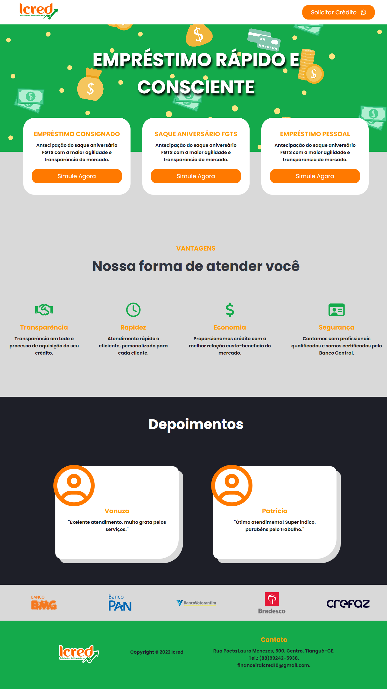

## **<h2 align="center"> Icred Website 💻</h2>**

## :pushpin: About this project:
Simple personal project made for a virtual credit agency, this project is not a real application, as it was developed with the intention of putting into practice the knowledge about html and css.

 

## :rocket: Technologies used:

  
	

 

## :star: Demonstration of the application

  

 

<h3 align="center"> 
	Application status: Developed ✔️
</h3>
 

## :information_source: Application installation
- `https://github.com/IgorPierre/icred-simple-site.git` to clone the repository

 
